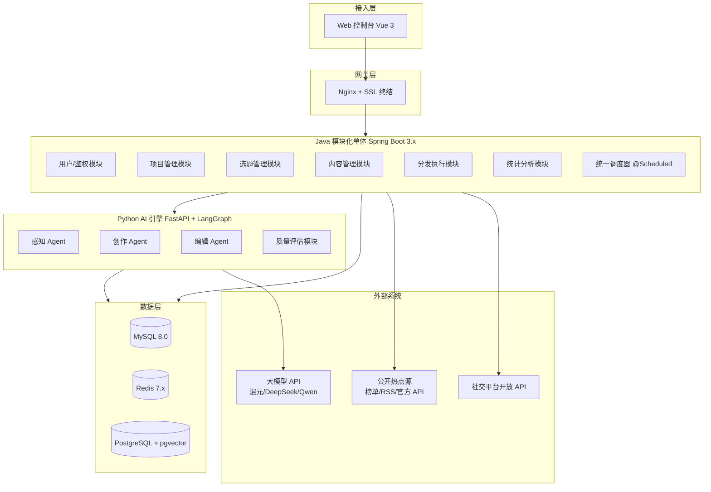
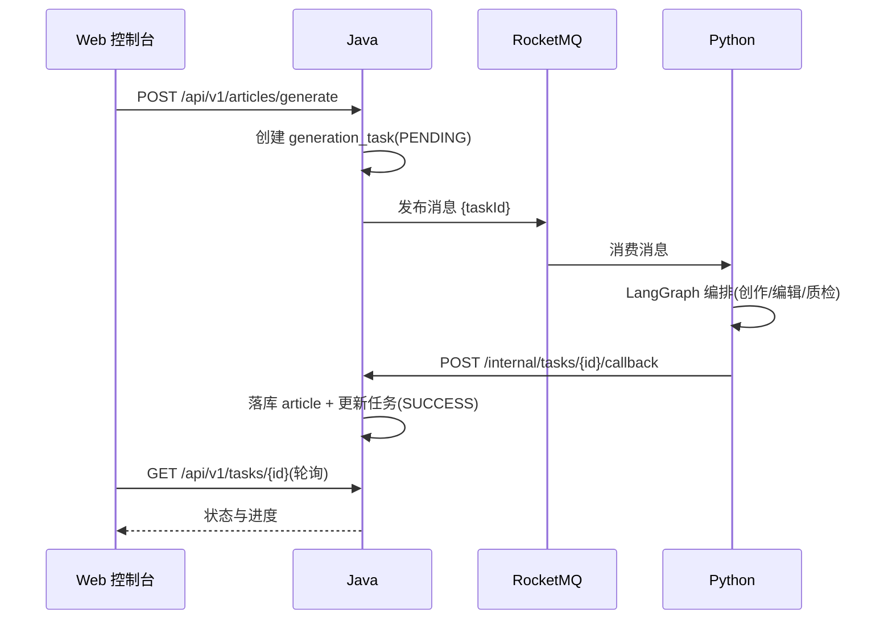
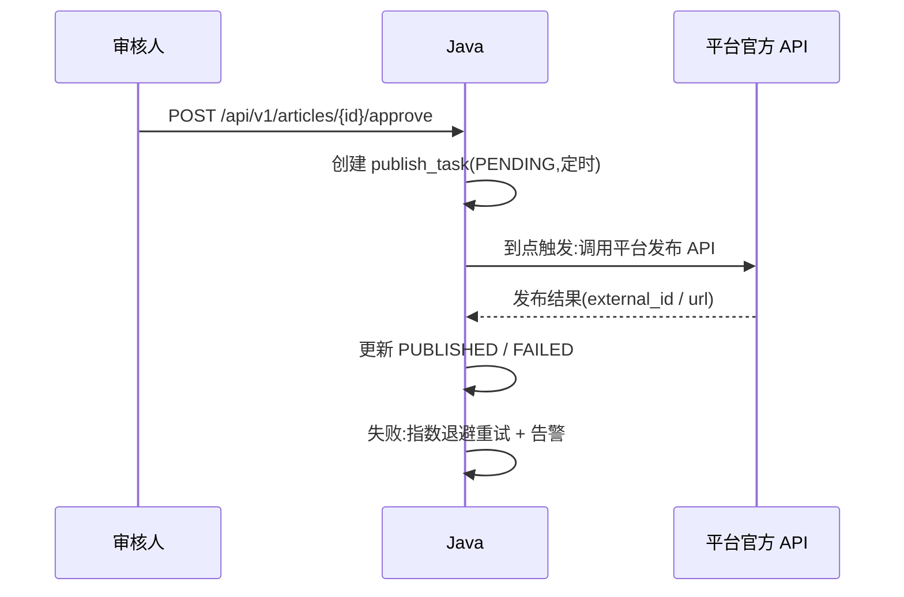
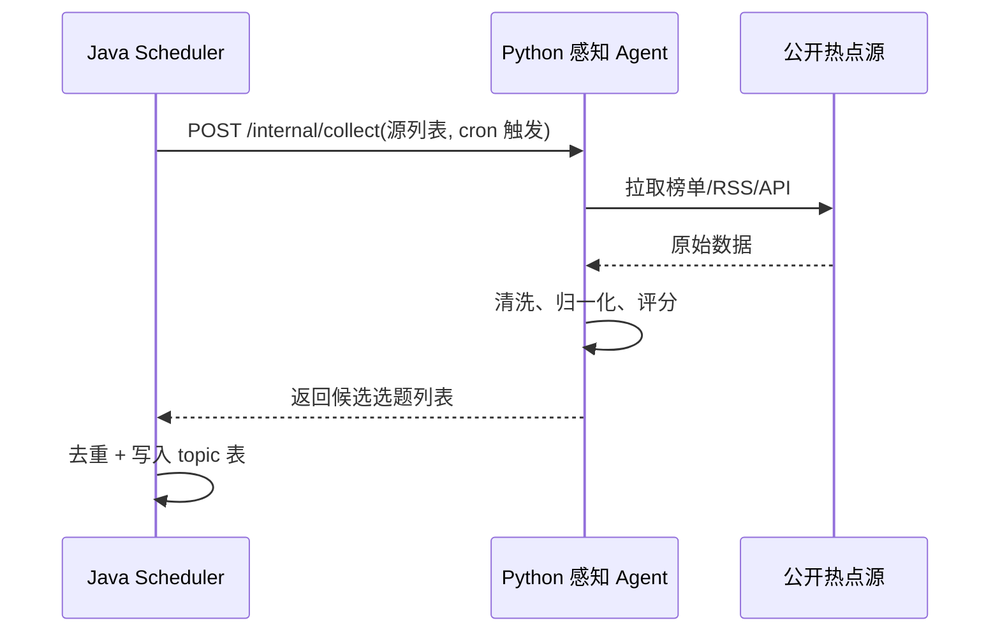

# AI 智能媒体助理(AIMA)系统 完整技术规划方案

> 文档版本:v2.2.0(整合稿)| 日期:2026-08-27 | 状态:评审稿

---

## 目录

1. [项目概述](#1-项目概述)
2. [系统架构](#2-系统架构)
3. [核心数据模型](#3-核心数据模型)
4. [模块详细设计](#4-模块详细设计)
5. [OpenAPI 接口清单](#5-openapi-接口清单)
6. [分发合规性设计](#6-分发合规性设计)
7. [向量数据库设计](#7-向量数据库设计)
8. [成本控制](#8-成本控制)
9. [可观测性设计](#9-可观测性设计)
10. [部署拓扑](#10-部署拓扑)
11. [MVP 范围与里程碑](#11-mvp-范围与里程碑)
12. [风险与应对](#12-风险与应对)
13. [附录](#13-附录)

---

## 1. 项目概述

### 1.1 项目愿景

构建一个**懂业务、会创作、能进化**的企业级 AI 智能媒体助理。系统覆盖 **"感知 → 创作 → 编辑 → 审核 → 分发 → 分析"** 全链路的媒体生产闭环,而非仅仅是一个"热点雷达"。

### 1.2 解决的核心痛点

| 痛点 | 描述 |
| --- | --- |
| **信息过载** | 人工无法实时追踪多平台热点与竞品动态 |
| **创作效率低** | 选题靠灵感,写稿耗时长,风格不稳定 |
| **分发盲目** | 不了解各平台规则,发布时间随意,效果差 |
| **数据割裂** | 内容发布后缺乏系统化的效果回收与迭代建议 |
| **合规风险** | 不了解平台政策,账号易被封禁 |

### 1.3 核心设计原则

| 原则 | 说明 |
| --- | --- |
| **Agentic** | 每个能力域由独立 Agent 负责,具备感知-决策-执行闭环 |
| **Model-Agnostic** | 可插拔式切换主流大模型(混元/DeepSeek/Qwen),避免供应商锁定 |
| **Human-in-the-Loop** | 关键产出环节(发布)保留人工审核门禁,确保安全与质量 |
| **API-First** | 所有能力以 RESTful API 暴露,便于前端集成和后期扩展 |
| **MVP-First** | 先做闭环,再做完美。第一期聚焦核心链路,第二期迭代增强 |
| **合规优先** | 分发以官方开放 API 为主,无 API 平台走半自动辅助,实验性模拟发布隔离且默认关闭 |

---

## 2. 系统架构

### 2.1 架构总览

采用 **"Java 模块化单体 + Python AI 引擎"** 的双服务架构,避免过度拆分带来的运维复杂度。

> 说明:消息队列 RocketMQ 独立部署,不在上图业务节点中展开;n8n 不进入 MVP,二期按需引入(见 13.2 决策记录);平台能力矩阵已初步确定(见第 6 节),接入前仍需逐平台确认资质与频率限制。

### 2.2 模块职责与边界

**Java 模块化单体(Spring Boot 3.x)**

| 模块 | 核心职责 | 关键说明 |
| --- | --- | --- |
| 用户/鉴权 | 登录、JWT、RBAC | 预留多租户字段 |
| 项目管理 | 项目/工作区 CRUD | MVP 可简化为单项目 |
| 选题管理 | 选题录入、热点导入、状态流转 | 采集源待定 |
| 内容管理 | 文章 CRUD、版本记录、审核状态机 | 业务数据的唯一写入口 |
| 分发执行 | 平台账号管理、发布任务、频率控制 | 官方 API 为主,半自动辅助,实验模块隔离 |
| 统计分析 | 发布结果回收、基础指标聚合 | 平台矩阵待定 |
| 统一调度器 | @Scheduled 定时触发采集、发布、巡检、重试 | 预留 Redisson 分布式锁 |

**Python AI 引擎(FastAPI + LangGraph)**

| 模块 | 核心职责 | 关键说明 |
| --- | --- | --- |
| 感知 Agent | 热点/竞品信息采集与聚合 | 由 Java 定时触发 |
| 创作 Agent | 选题 → 大纲 → 正文 | 走模型适配层 |
| 编辑 Agent | 风格适配、分段、AI 词过滤、配图建议 | 平台风格模板 |
| 质量评估 | 规则 + LLM 打分,输出分数与修改建议 | 默认方案见 4.3 |
| 模型适配层 | 混元/DeepSeek/Qwen 统一接口 | 供应商可插拔 |
| 向量服务 | embedding + pgvector 读写 | 预留 Milvus 切换接口 |

**数据写入原则**:MySQL 业务表唯一写入口是 Java;Python 通过回调把结果交给 Java 落库。向量库由 Python 写入(embedding 在 Python 侧),业务表与向量库的一致性通过任务状态机保证。

### 2.3 关键交互时序

**内容生成(异步)**

**发布(人工门禁 + 定时)**

**热点采集(定时)**

### 2.4 消息队列约定(RocketMQ)

- Topic:`aima-generation-task`;消费组:`aima-generation-group`;Producer 在 Java 侧,Consumer 在 Python 侧(`rocketmq-client-python`)
- 消息体只带 `taskId`,任务参数由 Python 按需读取,避免大消息
- 投递语义:at-least-once,消费者按任务状态幂等,防止重复消费导致重复生成
- 重试分级:消费端重试(默认 16 级,处理瞬时故障)与业务级重试(任务状态机,上限 2 次)分离
- 超过消费重试次数进死信队列 `%DLQ%aima-generation-group`,由定时任务扫描并转人工处理
- 部署依赖:NameServer + Broker,单节点即可跑 MVP(详见第 10 节)

---

## 3. 核心数据模型

| 表 | 关键字段 | 说明 |
| --- | --- | --- |
| `user` | id, username, password_hash, role | RBAC 角色 |
| `project` | id, name, owner_id | MVP 可预置默认项目 |
| `topic` | id, project_id, title, source, hot_score, status, keywords | 选题池 |
| `article` | id, project_id, topic_id, title, content, style_prompt, model_provider, status, quality_score, ai_word_count | 状态机见 4.1 |
| `generation_task` | id, article_id, type, status, params_json, model, error, retry_count | 生成任务 |
| `platform_account` | id, platform, account_name, token_encrypted, status, daily_limit | 凭据加密存储 |
| `publish_task` | id, article_id, account_id, publish_time, status, external_id, url, error, failure_reason | 发布任务 |
| `material` | id, type, oss_key, url, meta_json | 图片/素材 |
| `style_profile` | id, project_id, name, prompt, target_platform | 风格模板/风格记忆 |
| `audit_log` | id, user_id, action, entity_type, entity_id, before_json, after_json | 全量审计 |

---

## 4. 模块详细设计

### 4.1 文章状态机

`DRAFT → REVIEWING → APPROVED → PUBLISHED`,以及 `REJECTED → DRAFT`。质量评估未达标不允许进入 `REVIEWING`;`DRAFT` 不能直接跳到 `PUBLISHED`,人工审核是硬门禁。

### 4.2 任务状态机

- 生成任务:`PENDING → RUNNING → SUCCESS / FAILED`(重试上限 2 次,死信进 DLQ)
- 发布任务:`PENDING → PUBLISHING → WAIT_CALLBACK → SUCCESS / FAILED`;部分平台(如微信)提交后为异步,需等待平台回调(`PUBLISHJOBFINISH`)才能确认结果;失败按平台限流策略指数退避,超时转人工处理

### 4.3 质量评估(默认方案)

- 规则层:敏感词过滤(内置 + 自定义词库)、AI 高频词统计(首先/综上所述/总而言之)、重复率/相似度、字数与结构检查
- LLM 层:按主题相关性、可读性、平台风格贴合度三个维度打分,输出 0–100 分与修改建议
- 门禁:低于默认 75 分自动打回创作 Agent 重写(最多 2 次),通过后进入人工审核

### 4.4 调度与并发

- Java `@Scheduled` + Redisson 分布式锁,支持后续多实例
- 发布频率控制:每账号每日上限 + 最小间隔 + 全局并发限制,防止触发平台风控

---

## 5. OpenAPI 接口清单

| 方法 | 路径 | 说明 |
| --- | --- | --- |
| POST | `/api/v1/auth/login` | 登录 |
| POST | `/api/v1/auth/refresh` | 刷新 token |
| GET | `/api/v1/topics` | 选题列表 |
| POST | `/api/v1/articles/generate` | 提交生成任务(异步) |
| GET | `/api/v1/articles/{id}` | 文章详情 |
| PUT | `/api/v1/articles/{id}` | 人工编辑 |
| POST | `/api/v1/articles/{id}/submit-review` | 提交审核 |
| POST | `/api/v1/articles/{id}/approve` | 审核通过(进入发布队列) |
| POST | `/api/v1/articles/{id}/reject` | 打回 |
| GET | `/api/v1/tasks/{id}` | 生成任务状态(轮询) |
| POST | `/api/v1/publish-tasks` | 创建发布任务(指定时间) |
| GET | `/api/v1/publish-tasks` | 发布任务列表 |
| GET | `/api/v1/stats/overview` | 统计总览 |
| POST | `/api/v1/materials` | 素材上传 |
| GET | `/api/v1/articles/{id}/export` | 导出发布稿(半自动:一键复制/填入编辑器) |
| POST | `/internal/v1/tasks/{id}/callback` | Python → Java 内部回调(签名鉴权) |
| POST | `/internal/v1/collect` | Java → Python 采集触发(内部) |
| POST | `/api/v1/webhooks/wechat` | 微信发布结果回调(PUBLISHJOBFINISH,验签) |
| WS | `/ws/tasks` | 任务进度推送(可选) |

---

## 6. 分发合规性设计

分发策略按三档设计,按平台能力与风险分级:

**第一档:官方开放 API(主力,全自动)**

- 适用于公众号、抖音、百家号等有官方发布 API 的平台
- 走标准接口,支持定时发布、频率控制、结果回写
- 接入前逐平台确认资质门槛与频率限制(平台矩阵待定)

**第二档:半自动辅助(无官方 API 平台)**

- 适用于知乎、头条、小红书等无可用官方发布 API 的平台
- 系统生成内容并提供"一键复制/填入编辑器"的发布稿(`/api/v1/articles/{id}/export`)
- 最终发布动作由人工完成,系统不触碰平台登录态,账号零风险

**第三档:实验性模拟发布(隔离,默认关闭)**

- 仅作为实验模块,与第一/二档链路彻底隔离,默认关闭(feature flag 控制)
- 只能绑定低价值/可牺牲的小号,开启时强风险提示
- 发布频率限制到极低,失败熔断,不进入正式发布统计与审计主线
- 明确不承担账号封禁损失,风险由使用者确认承担

**平台现状速览(2026-08,详见 docs/平台矩阵与热点数据源调研.md)**

| 平台 | 官方发布 API | 档位 |
| --- | --- | --- |
| 微信公众号 | 草稿+freepublish(需企业主体已认证) | 第一档 |
| 抖音 | 视频/图文(需企业资质+对公认证) | 第一档 |
| 百家号 | 图文发布(门槛较低) | 第一档 |
| B站 | 视频投稿(需境内企业执照) | 第一档(视频)/待确认(专栏) |
| 微博 | 有接口但限流严(15次/时、50次/天) | 第二档 |
| 头条号 | 无(开放平台停止注册) | 第二档 |
| 知乎 | 无 | 第二档 |
| 小红书 | 无(仅白名单合作方) | 第二档 |
| 视频号/快手 | 待确认 | 第二档/待确认 |

**通用合规底线**

- 发布前硬性经过人工审核,状态机层面禁止绕过
- 凭据安全:平台 token 用 AES-256-GCM 加密存储,密钥放环境变量/KMS,日志禁止输出明文
- 频率控制:每账号每日上限、最小发布间隔、全局并发限制;触发限流时自动熔断并告警
- 失败处理:重试(指数退避)→ 告警 → 人工介入,全程可追溯
- 审计:审核、发布、取消等关键动作写入 `audit_log`
- 平台规则变更时,通过 feature flag 快速下线对应能力

---

## 7. 向量数据库设计

### 7.1 选型与切换策略

- MVP 默认 **pgvector**(PostgreSQL 扩展),独立 Postgres 实例承载
- 预留 **Milvus 切换接口**:统一 `VectorStore` 抽象(`upsert / delete / search`),通过配置切换,业务代码不感知
- 切换阈值(默认):向量总量超过 **10 万条** 或单表数据超 50GB,或召回耗时超标时评估切换 Milvus(standalone 需带 etcd + MinIO)

### 7.2 存储内容与表结构

| 表/类型 | 内容 | 说明 |
| --- | --- | --- |
| `embedding` | 文章/选题/风格模板的 chunk 向量 | entity_type + entity_id 关联业务表 |
| 索引 | HNSW,`vector_cosine_ops` | 相似度检索 |
| Embedding 模型 | 默认 `bge-m3`(本地部署,免费,中文效果好) | 预留 API 型 embedding 切换 |

字段:`id, entity_type, entity_id, chunk_text, embedding vector(1024), created_at`。

### 7.3 一致性原则

向量是派生数据,业务数据以 MySQL 为准。提供全量重建任务(scan MySQL → 重新 embedding → 覆盖),保证可修复。创建 Agent 通过向量检索做:相似选题去重、历史文章风格参考、RAG 素材召回。

---

## 8. 成本控制

| 手段 | 说明 |
| --- | --- |
| 模型分级 | 创作用旗舰模型(DeepSeek-V3 级别),质检/编辑用便宜模型(如 Qwen-Turbo);按任务类型配置默认模型 |
| Token 预算 | 每任务 `max_tokens` 上限,超限截断并记录;项目级月度预算,超预算熔断 |
| 缓存 | 相同 style_prompt + 主题的生成结果 Redis 缓存(MD5 key),避免重复生成 |
| 限流 | 每模型 QPS 限制,防突发费用;限流时排队而非无限重试 |
| 降级 | 模型超时/限流自动降级到备用模型,降级可配置 |
| Embedding 成本 | 本地 bge-m3 免费;若切 API embedding 需单独限流与预算 |
| 成本可视 | 按项目/模型/任务类型统计 token 与金额,月度报表 + 告警 |

参考量级:一篇 2000 字文章(输入输出合计约 6–8k token),按当前 DeepSeek 定价估算单篇生成成本约几分钱到几毛钱;月度 1000 篇的量级在可控范围,但必须靠预算熔断兜底。

---

## 9. 可观测性设计

- **日志**:统一 JSON 格式;`taskId` 作为贯穿 Java/Python 的关联 ID;关键业务事件(提交生成、审核、发布、失败)单独落 audit 日志
- **指标**(Prometheus + Grafana):任务成功率/耗时/重试率、MQ 积压、模型调用量与 token 消耗、发布成功率、平台限流率、成本汇总
- **链路追踪**:MVP 用 taskId 关联即可,预留 OpenTelemetry;Java → Python 调用在请求头透传
- **质量闭环**:发布后回收效果数据(阅读/互动),与质量分、风格、发布时间关联分析,二期反馈到创作提示词
- **告警**:任务连续失败、MQ 积压超阈值、平台限流、模型 API 错误率、成本超预算

---

## 10. 部署拓扑

**MVP(单机起步)**

| 组件 | 规格建议 |
| --- | --- |
| Java 服务 | 容器 |
| Python 服务 | 容器 |
| MySQL 8.0 | 容器或云 RDS |
| PostgreSQL + pgvector | 容器(独立实例) |
| Redis 7.x | 容器 |
| RocketMQ NameServer + Broker | 容器,单节点 |
| Nginx | 宿主机/容器,SSL 终结 |
| bge-m3 embedding | 默认容器部署;内存不足时先切 API embedding |

起步机器:4C8G 及以上(含 bge-m3 需 8G+);Docker Compose 编排,数据卷持久化。

**演进路径**:量上来后 MySQL/RocketMQ/向量库各自独立节点或上云托管;多实例部署时启用 Redisson 分布式锁;如需 K8s 再迁移。

**CI/CD**:GitHub Actions/GitLab CI → 构建镜像 → 推送 registry → 服务器拉取重启;密钥用环境变量/KMS;MySQL 每日备份,素材进 OSS。

---

## 11. MVP 范围与里程碑

**范围内**

- 感知:3 个主源(知乎热榜、B站热门、36氪/虎嗅 RSS)+ 节日日历静态源,Java 定时触发采集,选题进入选题池;微博热搜列为二期实验源
- 创作:选题 → 大纲 → 正文,模型可切换(混元/DeepSeek/Qwen),2 个风格模板起步
- 编辑:AI 高频词过滤、自动分段、配图建议(素材手动上传选图,AI 配图二期)
- 质量评估:规则 + LLM 打分 + 人工审核门禁(默认方案)
- 分发:发布任务 + 定时 + 频率控制;第一档先接公众号(认证号)验证全链路,再按内容形态接百家号(图文)或抖音(视频);第二档接入 1 个半自动平台(如知乎)验证导出复制流程;第三档实验模块默认不做
- 统计:发布状态与基础效果数据回收

**范围外**:短视频、热点榜单复杂 UI、学习 Agent、多租户、Chrome 插件、机器人接入、AI 配图。

**里程碑(建议 8 周)**

| 阶段 | 内容 | 验收 |
| --- | --- | --- |
| M1(1–2 周) | Java/Python 骨架、鉴权、RocketMQ 链路 | 提交生成 → MQ → Python → 回调全链路跑通 |
| M2(3–4 周) | 采集 + 选题池 + 创作/编辑/质检 Agent | 能产出通过质检的文章草稿 |
| M3(5–6 周) | 审核流 + 发布任务 + 第一个平台接入 | 人工审核后成功发布一篇 |
| M4(7–8 周) | 统计 + 部署上线 + 成本监控 | 全链路可用,单篇成本可控 |

---

## 12. 风险与应对

| 风险 | 应对 |
| --- | --- |
| 平台规则变更/API 关闭 | feature flag 快速下线能力;平台矩阵补充评估 |
| 平台资质门槛 | 公众号需认证、抖音/B站需企业资质 | MVP 前确认主体资质;无资质平台走第二档半自动 |
| 生成质量不稳定 | 质量评估 + 人工审核门禁 + 打回重写上限 |
| LLM 成本失控 | token 预算 + 模型分级 + 熔断 + 成本监控 |
| MQ/Python 链路故障 | 死信 + 重试 + 告警,任务状态机保证可恢复 |
| 热点源改版/封禁 | 多源冗余 + 源健康检查 + 降级提示 |
| 平台凭据泄露 | 加密存储 + 最小权限 + 审计日志 |
| 双语言栈维护成本 | 契约先行(OpenAPI)+ 数据写入口唯一(Java) |

---

## 13. 附录

### 13.1 技术版本清单

| 组件 | 版本 |
| --- | --- |
| Java / Spring Boot | 21 / 3.3.x |
| Python / FastAPI | 3.11 / 0.11x |
| LangGraph | 当前稳定版 |
| MySQL / Redis | 8.0 / 7.x |
| RocketMQ | 5.x |
| PostgreSQL / pgvector | 16 / 0.7+ |
| Vue / 构建 | 3 + Vite |
| Nginx | 1.24+ |

### 13.2 决策记录(ADR)

| 决策 | 结论 | 备注 |
| --- | --- | --- |
| 服务拆分 | Java 模块化单体 + Python AI 引擎 | 不引入微服务 |
| 消息队列 | RocketMQ | 消息只带 taskId,DLQ 兜底 |
| 向量库 | pgvector,预留 Milvus | 10 万条为切换参考阈值 |
| n8n | MVP 不引入,二期可选 | 运营自助/多租户场景再评估 |
| 质量评估 | 规则 + LLM 打分 + 人工门禁 | 默认阈值 75 分 |
| 分发策略 | 三档:官方 API 全自动 / 半自动辅助 / 实验模拟发布隔离 | 实验模块默认关闭 |
| 平台矩阵 | 第一档:公众号→百家号/抖音;B站 M3 后;其余第二档半自动 | 详见 docs/平台矩阵与热点数据源调研.md |
| 热点数据源 | 知乎热榜 + B站热门 + 36氪/虎嗅 RSS + 节日日历 | 微博热搜二期实验源 |

### 13.3 待定事项

- 平台矩阵与接入顺序:已初步确定(见第 6 节与 docs/平台矩阵与热点数据源调研.md),接入前仍需逐平台确认资质与频率限制
- 热点采集数据源:已确定(知乎热榜、B站热门、36氪/虎嗅 RSS、节日日历)
- n8n 引入触发条件(运营自助采集流 / 多租户工作流编辑器)
- Tier 3 实验性模拟发布模块是否启用(默认不启用,仅低价值账号场景评估)
